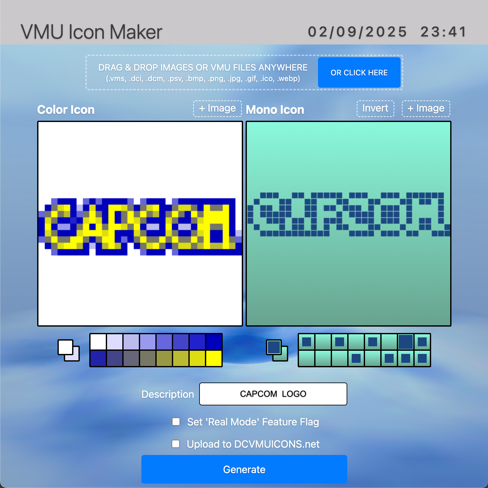

# VMU Icon Maker

VMU Icon Maker is a tool designed to create and manage icons for the Dreamcast VMU (Visual Memory Unit). This application allows users to generate, edit, and save ICONDATA_VMS icon files.




## Getting Started

To quickly get started with VMU Icon Maker, you have two options:

1. **Run in Browser**: Download the project and open `index.html` directly in your browser to start using the application without any installation.

2. **Download Release Build**: Download the latest release build for Windows, macOS, or Linux from the [releases page]([https://github.com/yourusername/vmu-icon-maker/releases](https://github.com/RobertDaleSmith/vmu-icon-maker/releases)) and run the application on your system.

## What are VMU Icons?

`ICONDATA_VMS` is a hidden file that can be stored on a VMS to get a custom icon for the VMS. In addition to the monochrome icon displayed on the VMS screen, you can also have a 16-colour icon for the DC file manager. 

## Features

- **Icon Creation**: Create and edit color and monochrome VMU icons using two drawable canvases with custom 16-color palette editor, 16-bit color picker.

- **Real Mode**: Sets special feature flag that enables a hidden 3D mode for the Dreamcast BIOS menu called "Real Mode".

- **Offline Functionality**: The app works entirely offline, with all necessary libraries included.

- **History Management**: Save and manage icon history with previews and metadata.

- **Import File Support**: Supports various file formats including `.vms`, `.dci`, `.dcm`, `.psv`, `.bmp`, `.png`, `.jpg`, `.gif`, `.ico`, and `.webp`.

- **Drag and Drop Support**: Drag and drop images to the application to import and convert them.

- **Automatic Image Conversion**: The app will automatically convert imported images to the Dreamcast VMU format.
  - Resizes images to 32x32 pixels
  - Reduces colors to a 16-bit 16 color palette.
  - Converts images to monochrome icon.
  - Extracts and converts icons from Dreamcast and PlayStation save files.

## Development Installation

1. **Clone the Repository**:
   ```bash
   git clone https://github.com/yourusername/vmu-icon-maker.git
   cd vmu-icon-maker
   ```

2. **Install Dependencies**:
   ```bash
   npm install
   ```

3. **Run the Application in development mode**:
   ```bash
   npm start
   ```

## Building the Application

To build the application for different platforms, use the following command:

- Run `npm run build` to generate production-ready builds for Linux, Windows, and macOS. The output will be located in the `dist` directory.

## File Structure

- **`main.js`**: Entry point for the Electron application.
- **`app.js`**: Contains the main logic for icon creation and management.
- **`index.html`**: The main HTML file for the application's interface.
- **`styles.css`**: Stylesheet for the application's UI.
- **`libs/`**: Directory containing external libraries like `three.js` and `jszip`.
- **`assets/`**: Contains icons and other static assets.

## Contributing

Contributions are welcome! Please fork the repository and submit a pull request for any improvements or bug fixes.

## License

This project is licensed under the MIT License. See the [LICENSE](LICENSE) file for details.

## Contact

For any questions or feedback, please contact [@RobertDaleSmith](https://x.com/RobertDaleSmith)).

## Resources

- [Dreamcast VMU Icon Format](https://nz17.com/interactive/dreamcast/dv_icy-dreamcast_vmu_icon_viewer_and_converter/Dreamcast%20Programming%20-%20ICONDATA_VMS.txt): Detailed information about the VMU icon file format.
- [Dreamcast 3D Menu](https://vmu.elysianshadows.com/evmu__icondata_8h.html): Detailed information about the 3D 'Real Mode' menu.
- [Dreamcast VMU Icons](http://dcvmuicons.net): Archive of Dreamcast VMU icons.
